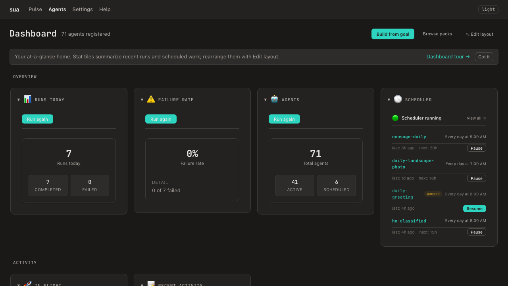
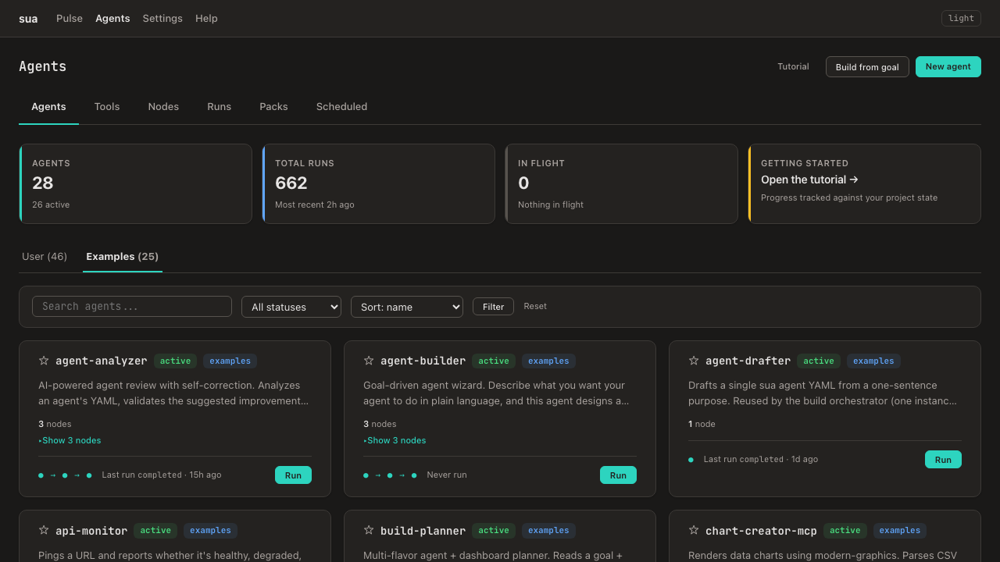
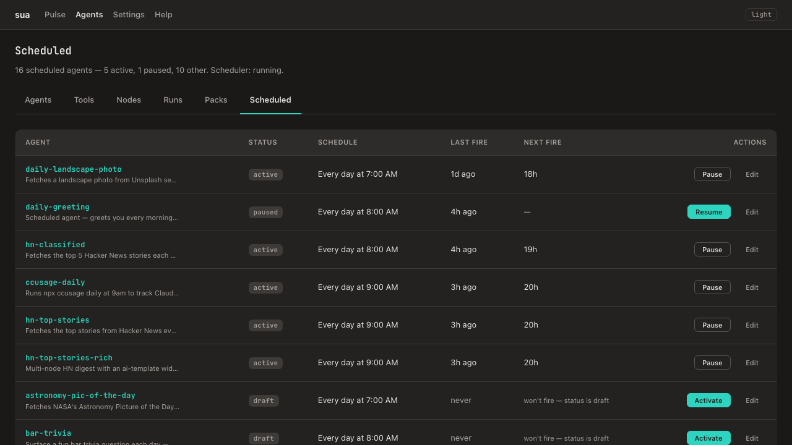
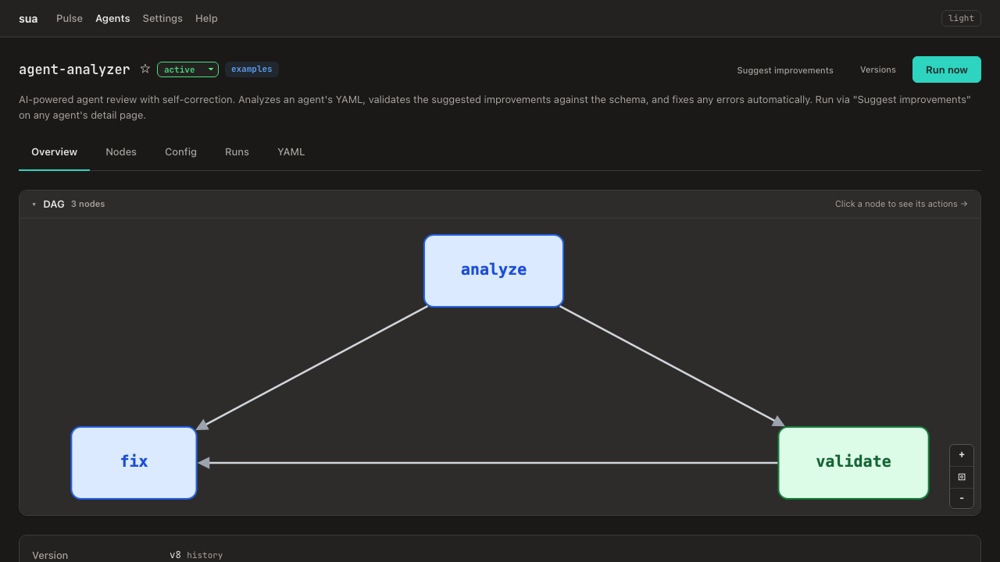
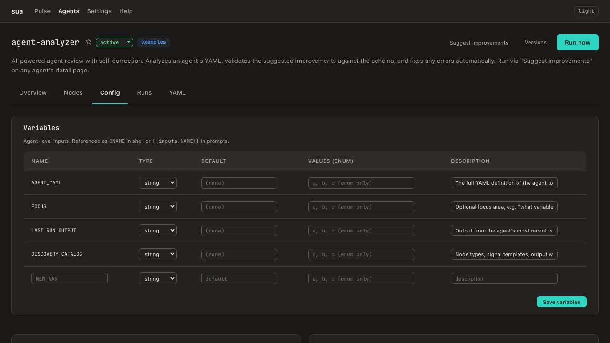
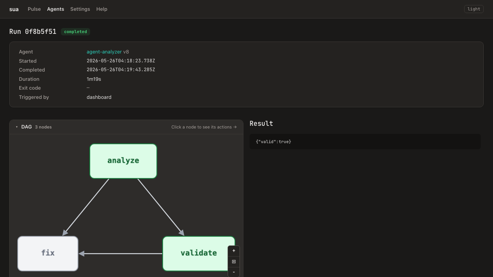

# some-useful-agents

A local-first agent playground. Author agents as composable flows, run them from the CLI or MCP, schedule them on cron, chain them into multi-step pipelines with branching and loops, and manage everything from a web dashboard.

MIT-licensed. Published to [npm](https://www.npmjs.com/search?q=%40some-useful-agents).



## What you get

- **Agents as flows** — each agent is a DAG of nodes. Nodes execute shell commands, `llm-prompt` LLM calls, or named tools. Flow control (conditional, switch, loop, agent-invoke, branch, end, break) lets agents make decisions and orchestrate sub-agents. Full reference: [docs/flows.md](docs/flows.md).
- **Multi-provider LLM support** — `llm-prompt` nodes (the canonical type; `claude-code` still works as an alias) can use Claude or Codex via the `provider` field. Set `model`, `maxTurns`, and `allowedTools` per node from the agent forms. Stream-json progress tracking shows real-time turn status during execution.
- **Built-in tools** — `shell-exec`, `http-get`, `http-post`, `file-read`, `file-write`, `json-parse`, `json-path`, `template`, `csv-to-chart-json`, plus the `llm-prompt` node type. Add MCP-imported tools, user-authored tools, and tools auto-generated by integrations. Full catalog: [docs/tools.md](docs/tools.md).
- **Integrations** — connect a data source or service at `/settings/integrations` and get tools for free: CSV / Postgres / SQLite kinds auto-generate find/count tools, Gmail connects via OAuth, and `notify` handlers can reference saved Slack / webhook / file destinations by id. Full guide: [docs/integrations.md](docs/integrations.md).
- **MCP servers as first-class** — paste a Claude Desktop / Cursor `mcpServers` config, sua discovers the tools, you pick which to import, and runs can call them like any other tool. Enable/disable/delete whole servers from `/settings/mcp-servers`. Full guide: [docs/mcp.md](docs/mcp.md).
- **Output widgets** — render run output as structured UI. Four built-in widget types (raw, key-value, diff-apply, dashboard) plus `ai-template` with an HTML grammar that supports `{{outputs.X}}`, `{{#each}}`, `{{#if}}` / `{{#unless}}` truthy conditionals (including inside `{{#each}}`), a first-class `table` field type, and sandboxed `<iframe>` from a small host allowlist (YouTube + Vimeo). Inline widget controls — `replay`, `field-toggle`, `view-switch`, `sort`, `filter`, `paginate` — drive interactivity from URL params with no client JS, render everywhere the widget renders, and are restylable by the widget's own `<style>` block. Mark a widget `interactive` and its tile re-runs in place. Full reference: [docs/output-widgets.md](docs/output-widgets.md).
- **Widget packs** — bundles of curated agents and dashboards that install as a unit. The bundled `Starter` pack ships three demo agents organised into Media + Weather dashboards. Browse + install at `/packs`; pack uninstall removes the dashboards but keeps the agents (reference-only ownership).
- **Dashboards** — named, ordered, sectioned views over installed agents. Pack-owned (e.g. `starter:media`) or user-created. Inline editor at `/dashboards/:id/edit` — add/remove/reorder sections and tiles, all server-rendered. The default dashboard at `/pulse` is auto-derived from per-agent `pulseVisible` flags.
- **Dashboard** — web UI for managing agents, tools, runs, secrets, variables, MCP servers, packs, and Pulse tiles. Visual DAG editor with wheel-zoom, drag-pan, and a floating `+/⧇/−` toolbar so dense graphs stay readable. The run-detail page has a sticky Node execution header with typed search + status filter that survives long node-card scrolls. Click-to-replay, YAML editor, template palette autocomplete, per-node action dialogs, live preview for output widgets. Full tour: [docs/dashboard.md](docs/dashboard.md).
- **Build from a goal, with a critic loop** — describe what you want in plain language and sua designs a complete plan (new agents, dashboard sections, references to existing agents). Three specialist agents run behind a server-side orchestrator: `goal-surveyor` breaks the goal into fragments, one `agent-drafter` per fragment writes the YAML (in parallel, each behind its own structural critic that re-fires the drafter up to twice on validation failures), and `dashboard-designer` assembles the tiles. If the goal is already covered by an existing agent you get a "Nothing to build" result instead of a crash; if some drafts fail you get a partial-success screen with a "Commit anyway" override. Telemetry at `/metrics/planner` tracks first-attempt-clean rate, retry counts, and commit rate. Full guide: [docs/build-from-goal.md](docs/build-from-goal.md).
- **AI suggest improvements** — one-click agent analysis via the built-in `agent-analyzer`. Reviews your agent's YAML, classifies changes, shows a colored diff, and auto-validates + fixes the suggested YAML before presenting it.
- **Global variables** — plain-text, non-sensitive values available to every agent. CRUD via `/settings/variables` or `sua vars` CLI. Referenced as `$NAME` in shell, `{{vars.NAME}}` in prompts.
- **MCP server (outbound)** — expose your agents to Claude Desktop and other MCP clients over HTTP/SSE.
- **Secrets store** — passphrase-encrypted at rest (scrypt N=2^17). Dashboard CRUD with copy-before-save modal and 3-layer redaction.
- **Scheduling** — cron expressions on any agent. The dedicated `/scheduled` page (under the Agents tab strip) lists every agent with a schedule regardless of status, with per-row **Pause** / **Resume** / **Activate** buttons and explanatory hints like "won't fire — status is draft" so a paused or unactivated agent is never invisible. The home Scheduled widget shows paused agents alongside active ones. Temporal provider available for durable workflows.
- **Run reliability** — wall-clock safety against orphaned LLM children burning tokens. Set `Agent.timeoutSec:` in YAML for a hard agent-level ceiling on top of per-node `timeout:`. On dashboard boot an orphan reaper scans for runs left in `running` by a prior daemon restart or crash, transitions them to `failed` with `errorCategory: 'abandoned'`, and (when the row carries a persisted child PID) SIGKILLs the orphaned process via a `ps`-based start-time cross-check that defends against PID reuse. The cancel route also escalates SIGTERM → SIGKILL after 5s so unresponsive CLIs don't strand state. See [docs/SECURITY.md § Orphan process reaper](docs/SECURITY.md).
- **15 bundled examples** — from "hello world" to MCP-driven graphics generation. Auto-installed on `sua init`.

## Quick start

```bash
npm install -g @some-useful-agents/cli
mkdir my-agents && cd my-agents
sua init                    # creates project + installs example agents
sua workflow run hello      # run your first agent
sua dashboard start         # open the web dashboard
```

Prefer `npx`? `npx @some-useful-agents/cli@latest init` works without installing globally.

## Example agents

Installed automatically by `sua init`. Manage with `sua examples install/remove/list`.

| Agent | What it teaches |
|---|---|
| `hello` | Your first agent, single shell node |
| `two-step-digest` | Chain nodes with `dependsOn` + upstream output passing |
| `daily-greeting` | Cron scheduling (`schedule: "0 8 * * *"`) |
| `parameterised-greet` | Agent inputs with defaults (`--input NAME=Greg`) |
| `conditional-router` | Flow control: conditional + onlyIf + branch merge |
| `research-digest` | Agent-invoke + loop (nested sub-flows) |
| `daily-joke` | HTTP tool fetching from icanhazdadjoke.com |
| `parameterised-greet-claude` | Claude Code companion (requires API key) |
| `llm-tells-a-joke` | Configurable topic input + clean prompt design |
| `agent-analyzer` | Self-correcting 3-node pipeline: analyze, validate, fix |
| `agent-builder` | Goal-driven wizard, builds agents from plain language |
| `system-health` | Disk/memory/CPU check with Pulse metric tile |
| `daily-summary` | Activity summary with Pulse text-headline tile |
| `graphics-creator-mcp` | Chains 5 modern-graphics MCP tools: theme → render → composite |
| `chart-creator-mcp` | CSV → `csv-to-chart-json` builtin → chart render via MCP |

## CLI commands

### Agents

```bash
sua agent list                          # all agents (examples + local)
sua agent new                           # interactive scaffold
sua agent run <name>                    # run once
sua agent run <name> --input K=V        # supply inputs
sua agent reimport <path>               # refresh agent(s) in DB from on-disk YAML
```

### Workflows (DAG agents)

```bash
sua workflow list                       # DAG agents in the store
sua workflow run <id>                   # execute a flow
sua workflow replay <runId> --from <nodeId>  # replay from a node
sua workflow import-yaml <file>         # import a v2 YAML into the store
```

### Tools

```bash
sua tool list                           # built-in + user tools
sua tool show <id>                      # inspect inputs/outputs
sua tool validate <file>                # schema-check a tool YAML
```

### Examples

```bash
sua examples install                    # import all bundled examples
sua examples remove                     # remove example agents from DB
sua examples list                       # show install status
```

### Variables

```bash
sua vars list                           # all global variables (names + values)
sua vars get <NAME>                     # get a variable's value
sua vars set <NAME> <VALUE>             # set/update a variable
sua vars delete <NAME>                  # remove a variable
```

### Secrets

```bash
sua secrets set <NAME>                  # store an encrypted secret
sua secrets list                        # list names (values hidden)
sua secrets delete <NAME>               # remove a secret
```

### Build planner

```bash
sua planner smoke                       # dry-run preview of pipeline scenarios
sua planner smoke --live                # run all 6 server scenarios end-to-end
sua planner smoke --live --browser      # also drive 2 wizard scenarios via playwright
```

### Infrastructure

```bash
sua init                                # initialize a project
sua doctor                              # check prerequisites
sua mcp start                           # start the MCP server
sua dashboard start                     # start the web dashboard
sua daemon start                        # run dashboard + scheduler + MCP detached
sua schedule list                       # show scheduled agents
```

## Dashboard

Start with `sua dashboard start`. Dark mode by default, JetBrains Mono, warm stone neutrals.











- **Pulse** — information radiator at `/pulse`, the default dashboard. Signal tiles show agent output as live widgets. 10 display templates including `widget` (mirrors the agent's own outputWidget schema). Drag-and-drop reorder, widget palette with auto-theming, system metric tiles, markdown rendering, YouTube media player, tile collapse/expand, scrollable tile body with pinned chrome. A switcher dropdown at the top of the page lets you flip between Default and any installed pack/user dashboard. "Hide all" / "Show all" buttons bulk-toggle every signal — useful before installing a pack.
- **Tiles that run themselves** — adding an agent to a dashboard runs it once automatically so the tile is never blank. "Run again" re-runs the agent and refreshes the tile in place instead of navigating away. If a widget references an external image host that the dashboard's CSP blocks, a one-click "allow" modal adds it to the agent's `img-src` allowlist.
- **Packs** — `/packs` lists all registered packs (bundled + user-created), shows install state, and routes Install/Uninstall through one click. Built-in packs ship in `packages/core/packs/*.yaml` and auto-register on daemon start.
- **Dashboards** — render at `/dashboards/:id`, edit at `/dashboards/:id/edit`. Pack-owned dashboards are editable (rename, reorder, add/remove tiles) but not deletable; uninstall the pack instead. User-created dashboards are deletable. Create a new one from the dropdown's "+ New dashboard name" input.
- **Build from goal** — Build button on the home page (`/`) and `/agents`. Describe what you want in plain language. A server-side orchestrator runs `goal-surveyor` → one `agent-drafter` per fragment (parallel, each behind its own structural critic) → `dashboard-designer`, producing a complete plan: new agents, dashboard sections, and references to existing agents you already have. Already-covered goals return "Nothing to build"; mixed results show a partial-success screen. Review the generated YAML before saving; "Commit anyway" lets you override unresolved warnings. Full guide: [docs/build-from-goal.md](docs/build-from-goal.md).
- **Improve layout** — wizard on `/pulse` and any `/dashboards/:id`. Starts from the current layout and proposes what to surface, what installed-but-absent agents to add (Path A), and what brand-new agents to draft inline (Path B). Same drafter + critic as Build from goal.
- **Schedule editor** — `/agents/<id>/config` has a Schedule card so you can set or clear a cron expression without hand-editing YAML. Server-side validation rejects invalid expressions and sub-minute cadences (unless the agent opts in via `allowHighFrequency: true`).
- **Agents** — card grid with **User / Examples / Community tabs**, per-tab counts, filtering (status, search), sorting, pagination. 5-tab detail page: Overview (DAG viz, stats), Nodes (edit/delete/add), Config (variables, output widget, signal, secrets), Runs (history), YAML (editor).
- **Output widget editor** — at `/agents/:id/config`, pick from visual cards (raw / key-value / diff-apply / dashboard / ai-template), load one of 5 starter examples in one click, watch a live preview rerender as you edit. Full reference: [docs/output-widgets.md](docs/output-widgets.md).
- **Tools** — browse **User / Built-in tabs** with per-tab counts, filtering, pagination. Paste a Claude-Desktop-style config at `/tools/mcp/import` to import MCP servers wholesale.
- **Settings → MCP Servers** — list of imported MCP servers with tool counts, enable/disable toggle, cascade delete.
- **Suggest improvements** — AI-powered agent review with "Apply now" one-click save. Auto-fixes shell template mistakes. Available from failed run pages with the error pre-filled.
- **Runs** — filter by agent/status, paginate, replay from any node, resolved variables panel, real-time turn progress for LLM nodes.
- **Settings** — secrets CRUD with passphrase unlock, global variables, MCP servers, MCP token rotation.
- **Tutorial** — 8-step guided walkthrough that scaffolds agents and culminates in installing the bundled Starter pack.

## Flow control

Agents support first-class flow control nodes:

```yaml
nodes:
  - id: fetch
    type: shell
    command: echo '{"status": 200, "data": "ok"}'

  - id: check
    type: conditional
    dependsOn: [fetch]
    conditionalConfig:
      predicate: { field: status, equals: 200 }

  - id: process
    type: shell
    command: echo "Processing..."
    dependsOn: [check]
    onlyIf: { upstream: check, field: matched, equals: true }

  - id: fallback
    type: shell
    command: echo "Fetch failed"
    dependsOn: [check]
    onlyIf: { upstream: check, field: matched, notEquals: true }
```

Available node types: `conditional`, `switch`, `loop`, `agent-invoke`, `branch`, `end`, `break`.

## Security

- **Secrets encrypted at rest** — AES-256-GCM with scrypt KDF (OWASP 2024 params)
- **3-layer redaction in run logs** — declared secrets, sensitive name patterns (TOKEN, KEY, PASS), known credential value patterns (GitHub PATs, AWS keys, JWTs)
- **Path traversal protection** — file-read/file-write tools validate paths stay within the working directory
- **Env-var injection deny-list** — agent inputs cannot override LD_PRELOAD, PATH, NODE_OPTIONS, or 25+ other sensitive env vars
- **MCP binds localhost** — bearer token auth, loopback-only by default, timing-safe token comparison
- **Community shell gate** — community agents require explicit `--allow-untrusted-shell`
- **Dashboard auth** — 3-layer (Host + Origin + cookie), HttpOnly SameSite=Strict cookies, 8-hour expiry
- **CI/CD** — SHA-pinned GitHub Actions, npm Trusted Publishing via OIDC (no static NPM_TOKEN)
- **Example agents vetted** — CI security check + execution test on every PR

Full model: [docs/SECURITY.md](docs/SECURITY.md)

## Packages

| Package | Description |
|---|---|
| [@some-useful-agents/core](https://www.npmjs.com/package/@some-useful-agents/core) | Types, schemas, stores, executor, tools, secrets |
| [@some-useful-agents/cli](https://www.npmjs.com/package/@some-useful-agents/cli) | CLI commands, tutorial, scaffolding |
| [@some-useful-agents/dashboard](https://www.npmjs.com/package/@some-useful-agents/dashboard) | Web dashboard (Express, server-rendered HTML) |
| [@some-useful-agents/mcp-server](https://www.npmjs.com/package/@some-useful-agents/mcp-server) | MCP server (HTTP/SSE transport) |
| [@some-useful-agents/temporal-provider](https://www.npmjs.com/package/@some-useful-agents/temporal-provider) | Temporal worker for durable workflows |

## Requirements

- Node.js >= 22.5.0
- macOS or Linux (Windows untested)
- Docker (optional, for Temporal or docker-stdio MCP servers)

## Documentation

- [Quickstart](docs/quickstart.md) — 30-minute first-touch guide
- [Agents](docs/agents.md) — YAML reference: inputs, nodes, schedule, signal, output widget
- [Flows](docs/flows.md) — conditional, switch, loop, agent-invoke, branch, end, break
- [Tools](docs/tools.md) — built-in tools, MCP tools, user-authored tools
- [MCP servers](docs/mcp.md) — import, enable/disable, lifecycle
- [Integrations](docs/integrations.md) — CSV/Postgres/SQLite/Gmail kinds, auto-generated tools, notify destinations
- [Output widgets](docs/output-widgets.md) — widget types, field mapping, AI templates
- [Templating](docs/templating.md) — `{{inputs.X}}`, `{{upstream.X.result}}`, `{{vars.X}}`
- [Dashboard tour](docs/dashboard.md) — every page, what it's for
- [Security model](docs/SECURITY.md) — threat model, secrets, sanitizer, MCP trust
- [Architecture decisions](docs/adr/) — MADR-lite records for load-bearing choices

## License

MIT
