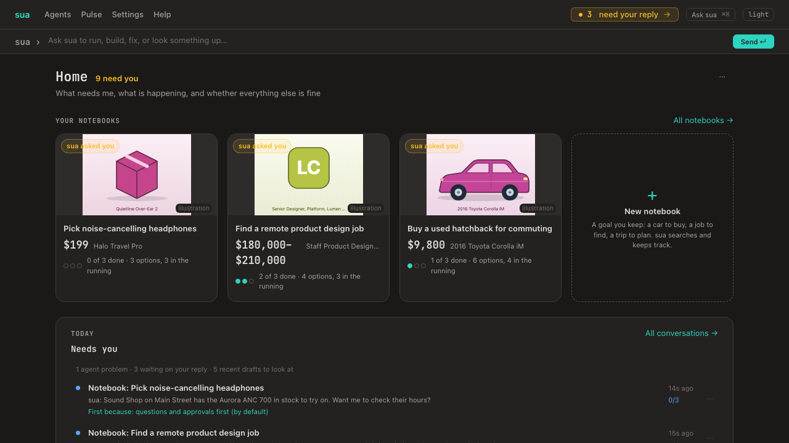
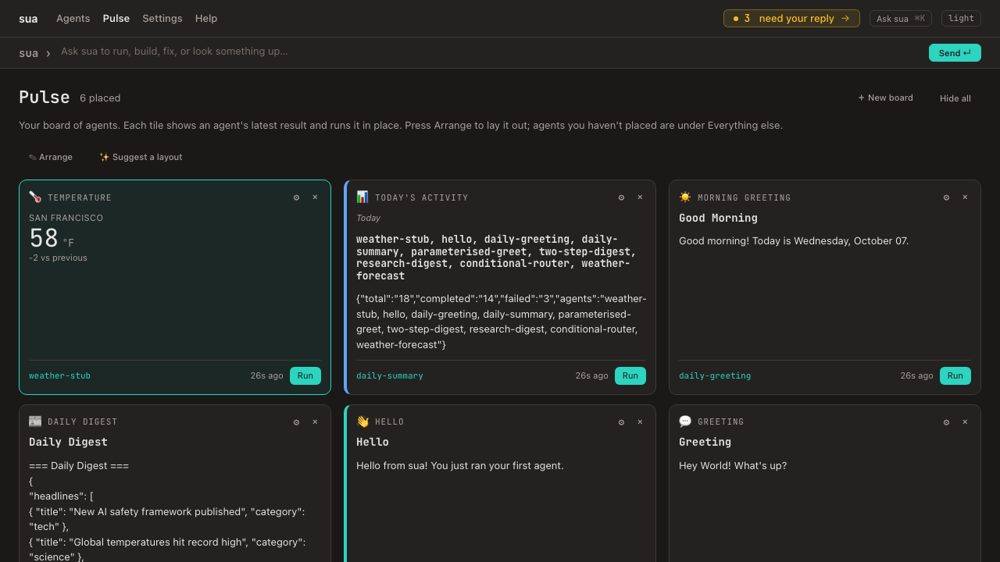
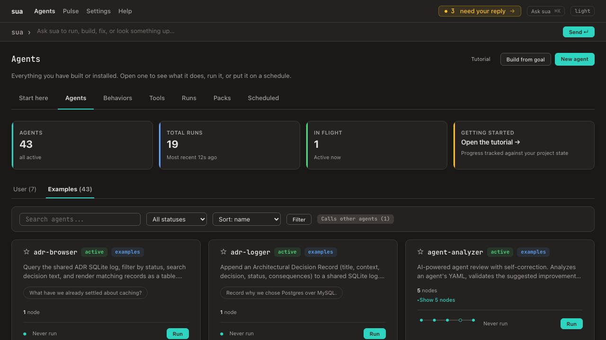
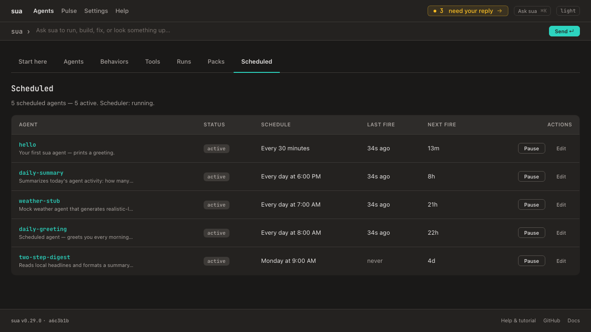
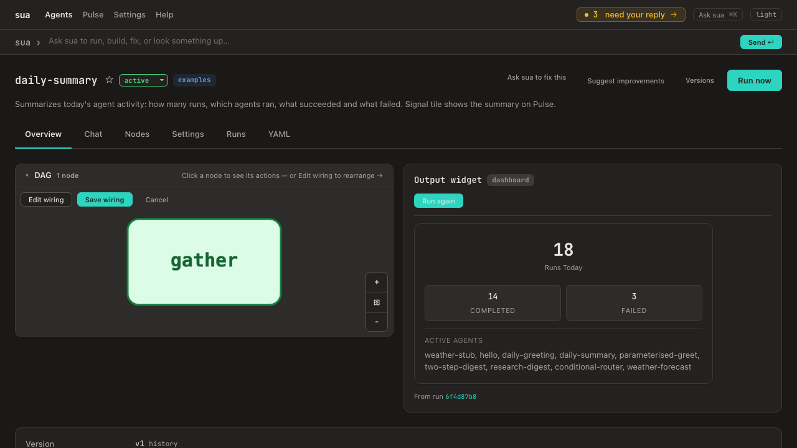
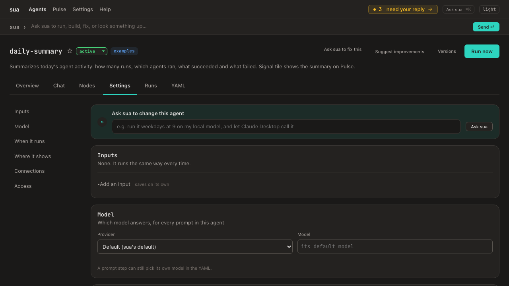
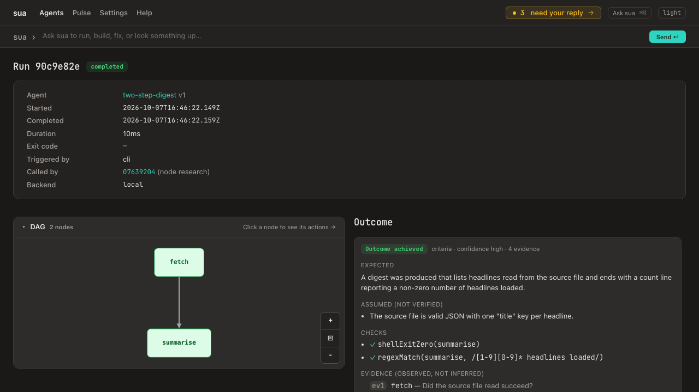
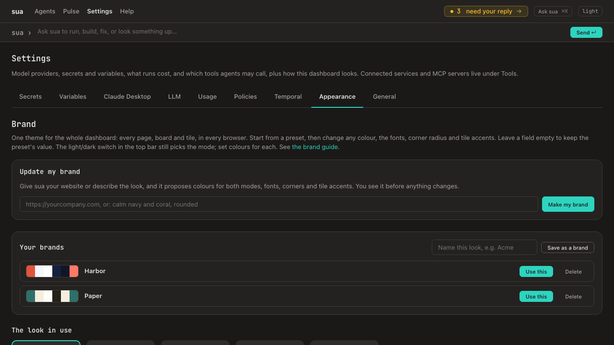

# some-useful-agents

A local-first agent playground. Author agents as composable flows, run them from the CLI or MCP, schedule them on cron, chain them into multi-step pipelines with branching and loops, and manage everything from a web dashboard.

MIT-licensed. Published to [npm](https://www.npmjs.com/search?q=%40some-useful-agents).



## What you get

**Agents**
- **Agents as flows** — each agent is a DAG of nodes: shell commands, `llm-prompt` model calls, named tools, `goal` nodes, and `ask` nodes. Flow control (conditional, switch, loop, agent-invoke, branch, end, break) lets agents make decisions and run sub-agents. Reference: [docs/flows.md](docs/flows.md).
- **Goal agents** — a `goal` node gives a model a goal, tools and a budget (turns, time), and it works until it can answer. Build from goal drafts one for open-ended asks. See [docs/goal-agents.md](docs/goal-agents.md).
- **Agents as tools** — put `agent:<id>` in a node's `tools:` and the model can call another agent as a sub-run (up to 3 levels deep, no cycles). See [docs/agents-as-tools.md](docs/agents-as-tools.md).
- **Conversations** — talk to any agent with a text input and follow up: the agent's **Chat** tab (replies stream in live over a WebSocket), `sua agent chat`, or MCP `run-agent` with a `sessionId`. See [docs/conversations.md](docs/conversations.md).
- **Memory** — `memory: true` gives an agent notes that persist between runs, recalled automatically, with `memory-save` / `memory-search` / `memory-forget` tools. See [docs/memory.md](docs/memory.md).
- **Ask a person** — an `ask` node, or the `ask-human` tool in an llm or goal node, pauses the run and puts the question in your inbox; answering resumes it. See [docs/ask-a-person.md](docs/ask-a-person.md).
- **Behaviors** — write down how an agent should conduct itself as an [Agent Behavior](docs/behaviors.md) spec, and optionally let it steer the agent.

**Models and tools**
- **Many providers, with a fallback waterfall** — Claude, Codex, on-device Apple Foundation Models, or any **OpenAI-compatible endpoint** for local / self-hosted models (llama.cpp, LM Studio, Ollama, vLLM, …). Reorder, add and enable/disable providers at `/settings/llm`; on a classified failure (down, timeout, quota, 401, 429) the run falls through to the next one. Pin per node or agent with `provider:`. Claude and Codex get a node's `tools:` over a short-lived local MCP endpoint; OpenAI-compatible endpoints get them natively. A local model server can run as a `sua daemon` service. See [docs/llm-providers.md](docs/llm-providers.md).
- **Built-in tools** — `shell-exec`, `http-get`, `http-post`, `file-read`, `file-write`, `json-parse`, `json-path`, `template`, `csv-to-chart-json`, web fetch and scrape, `board-read` / `board-place`, and more; plus MCP-imported tools, your own tools, and tools generated by integrations. Every tool call is recorded on the run page. See [docs/tools.md](docs/tools.md).
- **Integrations** — connect a data source or service at `/tools?tab=integrations` and get tools for free: CSV / Postgres / SQLite generate find/count tools, Gmail connects via OAuth, and `notify` handlers can use saved Slack / webhook / file destinations. See [docs/integrations.md](docs/integrations.md).
- **MCP servers** — paste a Claude Desktop / Cursor `mcpServers` config, pick which tools to import, and runs can call them like any other tool. Manage servers at `/tools?tab=servers`. See [docs/mcp.md](docs/mcp.md).

**Control and safety**
- **Tool policies** — allow/deny rules checked on every tool call, by tool, resource (URL, path, command) and agent source. Edit and test them in **Settings → Policies** ("Would this be allowed?"). See [docs/tool-policies.md](docs/tool-policies.md).
- **Cost and spend limits** — every run records its tokens and cost; see them per run, in **Settings → Usage**, or with `sua usage`. Cap a run or an agent's day with `spendLimit: { perRunUsd, perDayUsd }`. See [docs/cost.md](docs/cost.md).
- **Secrets store** — encrypted at rest (AES-256-GCM, scrypt). Protect it with a passphrase, or use the zero-friction fallback keyed off a stable local machine key. Dashboard CRUD with redaction.
- **Run reliability** — per-node `timeout:` and agent `timeoutSec:` ceilings; a reaper fails runs orphaned by a restart and kills their leftover processes; cancel escalates to SIGKILL. See [docs/SECURITY.md](docs/SECURITY.md).

**Triggers**
- **Scheduling** — cron on any agent; `/scheduled` lists every scheduled agent with Pause / Resume / Activate, and Pulse shows a red scheduler tile if agents are scheduled but the scheduler isn't running. A Temporal provider is available for durable runs. See [docs/temporal.md](docs/temporal.md).
- **Inbound webhooks** — start an agent from another service with `POST /hooks/<agent>`: a per-agent secret (or a GitHub signature), body-to-input mapping and filters. See [docs/webhooks.md](docs/webhooks.md).
- **MCP server (outbound)** — expose your agents to Claude Desktop and other MCP clients; `run-agent` also holds conversations (`message` + `sessionId`), `board-read` / `board-place` arrange boards, and `build-board` builds one from a request. See [docs/mcp.md](docs/mcp.md).

**Notebooks: goals you keep**
- **Notebooks** — a goal sua keeps for you over time: a car to buy, a job to find, a place to rent. Say it in a sentence and sua drafts the notebook (limits, what "done" means, what to note for each option, stages, which agents search); then it searches, files what it finds as options with their facts and pictures, and tracks them through a funnel to a decision. Talk to sua about it in its own conversation. See [docs/notebooks.md](docs/notebooks.md).

**Seeing results**
- **Dashboard** — manage agents, tools, runs, secrets, variables and settings in the browser. **Home** shows your notebooks and what needs you today; **Pulse** (`/pulse`) is your board of agent tiles, and every tile has a **Run** button. Visual DAG editor with a wiring mode, run pages with node-by-node detail, budgets and tool calls. See [docs/dashboard.md](docs/dashboard.md).
- **Widgets, drawn with A2UI** — an agent can describe its widget as an [A2UI](https://a2ui.org) `view:` (declared in YAML, or generated by a node each run), and it's drawn on the run page, its Pulse tile, dashboards, inbox threads, and as a chat reply whose buttons send the next message. Existing output widgets and Pulse templates are drawn the same way, with sorting, filtering, paging, tabs and run-in-place forms in the browser. See [docs/a2ui-views.md](docs/a2ui-views.md) and [docs/output-widgets.md](docs/output-widgets.md).
- **Boards as canvases** — Pulse and every dashboard are drawn as one A2UI canvas: sections, responsive grids, rows, tabs and cards, with each agent's tile drawn inside by its own view. Arrange it in an outline editor (**✎ Arrange**), let the layout planner propose one (**✨ Suggest a layout**), or let an agent do it with the `board-read` / `board-place` tools. Layouts are stored by the dashboard, versioned and undoable. See [docs/boards.md](docs/boards.md).
- **Build a board from a request** — describe a board (**＋ New board**, Ask sua, or MCP `build-board`) and sua picks your agents, lays it out, runs every tile and tells you in the inbox when it's ready; agents for anything not covered are drafted and wait for your one approval. See [docs/boards.md](docs/boards.md#build-a-board-from-a-request).
- **Brand theme** — one theme for every page, board and tile: a preset, then your colours for dark and light mode, fonts, corner radius and tile accents, in **Settings → Appearance → Brand**. See [docs/brand.md](docs/brand.md).
- **Dashboards and packs** — named boards over your agents; packs install curated agents and dashboards together (the `Starter` pack ships with sua). Browse at `/packs`.

**Building agents**
- **Build from a goal** — describe what you want and sua drafts the agents (a goal node for open-ended asks, a fixed flow for repeatable ones), shows each draft's shape and **why**, lets you switch the shape and **Try it** before keeping it. See [docs/build-from-goal.md](docs/build-from-goal.md).
- **Suggest improvements** — one-click review of an agent's YAML by the built-in `agent-analyzer`, with a diff you can apply.
- **Global variables** — plain-text values every agent can use (`/settings/variables` or `sua vars`); `$NAME` in shell, `{{vars.NAME}}` in prompts.
- **40+ bundled examples** — from "hello world" to MCP-driven graphics, installed by `sua init`. The dashboard opens new users on **Start here** (`/start`): four agents, one per pattern (research something, watch something, draft something, work it out).

## Quick start

```bash
npm install -g @some-useful-agents/cli
mkdir my-agents && cd my-agents
sua init                    # creates project + installs example agents
sua agent run hello         # run your first agent
sua dashboard start         # open the web dashboard
```

Prefer `npx`? `npx @some-useful-agents/cli@latest init` works without installing globally.

## Example agents

Installed automatically by `sua init`. Manage with `sua examples install/remove/list`.

| Agent | What it teaches |
|---|---|
| `hello` | Your first agent, single shell node |
| `two-step-digest` | Chain nodes with `dependsOn` + upstream output passing |
| `daily-greeting` | Cron scheduling (`schedule: "0 8 * * *"`) |
| `parameterised-greet` | Agent inputs with defaults (`--input NAME=Greg`) |
| `conditional-router` | Flow control: conditional + onlyIf + branch merge |
| `research-digest` | Agent-invoke + loop (nested sub-flows) |
| `daily-joke` | HTTP tool fetching from icanhazdadjoke.com |
| `parameterised-greet-claude` | Claude Code companion (requires API key) |
| `llm-tells-a-joke` | Configurable topic input + clean prompt design |
| `agent-analyzer` | Self-correcting 3-node pipeline: analyze, validate, fix |
| `agent-builder` | Goal-driven wizard, builds agents from plain language |
| `system-health` | Disk/memory/CPU check with Pulse metric tile |
| `daily-summary` | Activity summary with Pulse text-headline tile |
| `graphics-creator-mcp` | Chains 5 modern-graphics MCP tools: theme → render → composite |
| `chart-creator-mcp` | CSV → `csv-to-chart-json` builtin → chart render via MCP |

## CLI commands

### Agents

```bash
sua agent list                          # all agents (examples + local)
sua agent new                           # interactive scaffold
sua agent run <name>                    # run once
sua agent run <name> --input K=V        # supply inputs (-i for short)
sua agent chat <name>                   # talk to an agent and follow up (-m "…" for one message)
sua agent webhook <name> --on           # start it from another service: POST /hooks/<name>
sua agent reimport <path>               # refresh agent(s) in DB from on-disk YAML
```

### Memory, cost and policies

```bash
sua memory list <agent>                 # what an agent remembers (also: search, pin, forget)
sua usage --days 7                      # what runs cost, by agent and provider
sua policy show                         # the tool policy in force (also: check, validate)
sua behaviors list                      # Agent Behavior specs (also: show, validate)
```

### Lower-level agent tools

`sua agent run` / `sua agent list` cover every agent; `sua workflow` has the extra tools.

```bash
sua workflow list                       # agents in the store, with their nodes
sua workflow run <id>                   # execute an agent's flow
sua workflow replay <runId> --from <nodeId>  # replay from a node
sua workflow import-yaml <file>         # import a v2 YAML into the store
```

### Tools

```bash
sua tool list                           # built-in + user tools
sua tool show <id>                      # inspect inputs/outputs
sua tool validate <file>                # schema-check a tool YAML
```

### Examples

```bash
sua examples install                    # import all bundled examples
sua examples remove                     # remove example agents from DB
sua examples list                       # show install status
```

### Variables

```bash
sua vars list                           # all global variables (names + values)
sua vars get <NAME>                     # get a variable's value
sua vars set <NAME> <VALUE>             # set/update a variable
sua vars delete <NAME>                  # remove a variable
```

### Secrets

```bash
sua secrets set <NAME>                  # store an encrypted secret
sua secrets list                        # list names (values hidden)
sua secrets delete <NAME>               # remove a secret
```

### Build planner

```bash
sua planner smoke                       # dry-run preview of pipeline scenarios
sua planner smoke --live                # run all 6 server scenarios end-to-end
sua planner smoke --live --browser      # also drive 2 wizard scenarios via playwright
```

### Infrastructure

```bash
sua init                                # initialize a project
sua doctor                              # check prerequisites
sua mcp start                           # start the MCP server
sua dashboard start                     # start the web dashboard
sua dashboard signin-url                # print the dashboard sign-in link again
sua daemon start                        # run dashboard + scheduler + MCP (+ model, worker) detached
sua schedule list                       # show scheduled agents
```

## Dashboard

Start with `sua dashboard start`. Dark mode by default, JetBrains Mono, warm stone neutrals. (These screenshots come from made-up fixture data; see [scripts/screenshots](scripts/screenshots/README.md).)
















- **Home** — `/` shows how things stand ("3 need you"), **Your notebooks** (a card each with its picture, best option, progress, and **sua asked you** when sua is waiting on you), and **Today**: what needs you, what's happening, and whether everything else is fine. Clicking a row opens it in the sua panel. The **Ask sua** bar on every page starts a conversation, and the reply streams into a panel beside the page that follows you as you move around (**Cmd/Ctrl+K** opens and closes it); open a notebook and the panel follows to its conversation. A nav badge counts what needs you. Every conversation, list and thread side by side, is at `/inbox`.
- **Notebooks** — `/notebooks` lists them with covers, search and filters; **+ New notebook** opens **Start a notebook** (a sentence, a draft to check, and suggestions from your conversations). A notebook's page shows where it stands, done-when, a price map and funnel, the shortlist, how we got here, and its conversation. See [docs/notebooks.md](docs/notebooks.md).
- **Pulse** — `/pulse` is your board of agent tiles, drawn as an A2UI canvas: what you've placed first, then every other agent under **Everything else** in tabs (Health / Recent / Idle / Never run). Each agent with a `signal:` (or a `view:`) shows its latest result; every tile has a **Run** button. 13 display templates. **✎ Arrange** lays it out; a dropdown switches to any installed pack or user dashboard; "Hide all" / "Show all" toggle every agent.
- **Tiles that run themselves** — adding an agent to a dashboard runs it once automatically so the tile is never blank. "Run again" re-runs the agent and refreshes the tile in place instead of navigating away. If a widget references an external image host that the dashboard's CSP blocks, a one-click "allow" modal adds it to the agent's `img-src` allowlist.
- **Packs** — `/packs` lists all registered packs (bundled + user-created), shows install state, and routes Install/Uninstall through one click. Built-in packs ship in `packages/core/packs/*.yaml` and auto-register on daemon start.
- **Dashboards** — canvases at `/dashboards/:id` (arrange them like Pulse; **Save as pack** exports the layout); rename and manage at `/dashboards/:id/edit`. Pack-owned dashboards are editable (rename, reorder, add/remove tiles) but not deletable; uninstall the pack instead. User-created dashboards are deletable. Create a new one from the dropdown's "+ New dashboard name" input.
- **Build from goal** — Build button on `/agents` and the home page. Describe what you want; `goal-surveyor` → one `agent-drafter` per fragment (in parallel, each behind a structural critic) → `dashboard-designer` produce a plan. Each draft shows its shape (diagram + label) and why it was chosen; switch a goal agent to a fixed flow or back, **Try it** without saving, then keep it. Full guide: [docs/build-from-goal.md](docs/build-from-goal.md).
- **Suggest a layout** — on Pulse and any dashboard: the layout planner proposes an arrangement, opened in the editor for you to adjust and save. To build a new board from a description instead, use **＋ New board**.
- **Schedule editor** — `/agents/<id>/config` has a Schedule card so you can set or clear a cron expression without hand-editing YAML. Server-side validation rejects invalid expressions and sub-minute cadences (unless the agent opts in via `allowHighFrequency: true`).
- **Agents** — card grid with **User / Examples / Community tabs**, ranked search, filtering, sorting, pagination. Detail page tabs: Overview (DAG, stats, "What you can ask" chips, memory, agent calls), **Chat**, Nodes (add/edit any node type, including goal nodes with a searchable tools picker; a wiring mode on the graph), Config (inputs, output widget, signal, secrets, schedule), Runs, YAML.
- **Output widget editor** — at `/agents/:id/config`, pick from visual cards (raw / key-value / diff-apply / dashboard / ai-template), load one of 5 starter examples in one click, watch a live preview rerender as you edit. Full reference: [docs/output-widgets.md](docs/output-widgets.md).
- **Tools** — the one home for everything an agent can call: **Imported / Built-in / Servers / Integrations** tabs, with counts, filtering and pagination. Paste a Claude-Desktop-style config at `/tools/mcp/import` to import MCP servers.
- **Settings → LLM** — the provider waterfall: reorder providers, add custom OpenAI-compatible endpoints (name / API base / model / key) with a reachability probe, and enable/disable any provider to run local-only. Full guide: [docs/llm-providers.md](docs/llm-providers.md).
- **Settings → Usage** — what runs cost over 1 / 7 / 30 days, by agent and provider, and default spend limits. See [docs/cost.md](docs/cost.md).
- **Settings → Policies** — the tool policy: add, edit, reorder and delete rules, edit as JSON, undo, and test "Would this be allowed?". See [docs/tool-policies.md](docs/tool-policies.md).
- **Settings → Appearance** — the **brand theme** (presets Default / Warm / Minimal / Neon / Editorial Paper, then your own colours, fonts, radius and tile accents), **Your brands** (save several, switch between them), **Update my brand** (sua proposes one from your website or a few words), plus the switches back to the previous widget renderer and the previous Pulse layout (each kept one more release).
- **Tools → Servers** — list of imported MCP servers with tool counts, enable/disable toggle, cascade delete.
- **Suggest improvements** — AI-powered agent review with "Apply now" one-click save. Auto-fixes shell template mistakes. Available from failed run pages with the error pre-filled.
- **Runs** — filter by agent/status/trigger, paginate, replay from any node, resolved variables, each node's tool calls, cost, and a goal node's budget used (turns, tool calls, time); sub-runs shown as a tree.
- **Settings** — Secrets (passphrase unlock), Variables, Claude Desktop (sua as an MCP server, token rotation), LLM, Usage, Policies, Temporal, Appearance, General.
- **Tutorial** — 8-step guided walkthrough that scaffolds agents and culminates in installing the bundled Starter pack.

## Flow control

Agents support first-class flow control nodes:

```yaml
nodes:
  - id: fetch
    type: shell
    command: echo '{"status": 200, "data": "ok"}'

  - id: check
    type: conditional
    dependsOn: [fetch]
    conditionalConfig:
      predicate: { field: status, equals: 200 }

  - id: process
    type: shell
    command: echo "Processing..."
    dependsOn: [check]
    onlyIf: { upstream: check, field: matched, equals: true }

  - id: fallback
    type: shell
    command: echo "Fetch failed"
    dependsOn: [check]
    onlyIf: { upstream: check, field: matched, notEquals: true }
```

Available node types: `conditional`, `switch`, `loop`, `agent-invoke`, `branch`, `end`, `break`.

## Security

- **Secrets encrypted at rest** — AES-256-GCM with scrypt KDF (OWASP 2024 params)
- **3-layer redaction in run logs** — declared secrets, sensitive name patterns (TOKEN, KEY, PASS), known credential value patterns (GitHub PATs, AWS keys, JWTs)
- **Path traversal protection** — file-read/file-write tools validate paths stay within the working directory
- **Env-var injection deny-list** — agent inputs cannot override LD_PRELOAD, PATH, NODE_OPTIONS, or 25+ other sensitive env vars
- **MCP binds localhost** — bearer token auth, loopback-only by default, timing-safe token comparison
- **Community shell gate** — community agents require explicit `--allow-untrusted-shell`
- **Dashboard auth** — 3-layer (Host + Origin + cookie), HttpOnly SameSite=Strict cookies; a 30-day idle session renewed as you use it (`SUA_DASHBOARD_SESSION_HOURS` to change); the chat WebSocket requires the same cookie plus an allowed Origin
- **Tool policies** — allow/deny rules checked on every tool call, failing closed if the policy file is invalid
- **CI/CD** — SHA-pinned GitHub Actions, npm Trusted Publishing via OIDC (no static NPM_TOKEN)
- **Example agents vetted** — CI security check + execution test on every PR

Full model: [docs/SECURITY.md](docs/SECURITY.md)

## Packages

| Package | Description |
|---|---|
| [@some-useful-agents/core](https://www.npmjs.com/package/@some-useful-agents/core) | Types, schemas, stores, executor, tools, secrets |
| [@some-useful-agents/cli](https://www.npmjs.com/package/@some-useful-agents/cli) | CLI commands, tutorial, scaffolding |
| [@some-useful-agents/dashboard](https://www.npmjs.com/package/@some-useful-agents/dashboard) | Web dashboard (Express, server-rendered HTML) |
| [@some-useful-agents/mcp-server](https://www.npmjs.com/package/@some-useful-agents/mcp-server) | MCP server (HTTP/SSE transport) |
| [@some-useful-agents/temporal-provider](https://www.npmjs.com/package/@some-useful-agents/temporal-provider) | Temporal worker for durable workflows |

## Requirements

- Node.js >= 22.5.0
- macOS or Linux (Windows untested)
- Docker (optional, for Temporal or docker-stdio MCP servers)

## Documentation

- [Quickstart](docs/quickstart.md) — 30-minute first-touch guide
- [Agents](docs/agents.md) — YAML reference: inputs, nodes, schedule, signal, output widget
- [Flows](docs/flows.md) — conditional, switch, loop, agent-invoke, branch, end, break
- [Goal agents](docs/goal-agents.md) — a model with a goal, tools and a budget
- [Agents as tools](docs/agents-as-tools.md) — `agent:<id>` in `tools:`
- [Conversations](docs/conversations.md) — chat with an agent; live replies over WebSocket
- [Memory](docs/memory.md) — what an agent remembers between runs
- [Ask a person](docs/ask-a-person.md) — `ask` nodes and the `ask-human` tool
- [Webhooks](docs/webhooks.md) — start an agent from another service
- [Cost](docs/cost.md) — what runs cost, and spend limits
- [Tool policies](docs/tool-policies.md) — allow/deny rules, the Policies editor
- [A2UI views](docs/a2ui-views.md) — widgets as declarative UI, the sua catalog
- [Behaviors](docs/behaviors.md) — Agent Behavior specs
- [Build from goal](docs/build-from-goal.md) — drafting agents from a description
- [Temporal](docs/temporal.md) — durable runs
- [LLM providers](docs/llm-providers.md) — the provider waterfall, custom OpenAI-compatible / local endpoints, enable/disable, node pins
- [Inbox control plane](docs/inbox-control-plane.md) — triage, run/build/resolve actions, widgets in threads
- [Tools](docs/tools.md) — built-in tools, MCP tools, user-authored tools
- [MCP servers](docs/mcp.md) — import, enable/disable, lifecycle
- [Integrations](docs/integrations.md) — CSV/Postgres/SQLite/Gmail kinds, auto-generated tools, notify destinations
- [Output widgets](docs/output-widgets.md) — widget types, field mapping, AI templates
- [Templating](docs/templating.md) — `{{inputs.X}}`, `{{upstream.X.result}}`, `{{vars.X}}`
- [Notebooks](docs/notebooks.md) — goals sua keeps for you: start from a sentence, options, the funnel, the conversation
- [Dashboard tour](docs/dashboard.md) — every page, what it's for
- [Security model](docs/SECURITY.md) — threat model, secrets, sanitizer, MCP trust
- [Architecture decisions](docs/adr/) — MADR-lite records for load-bearing choices

## License

MIT
