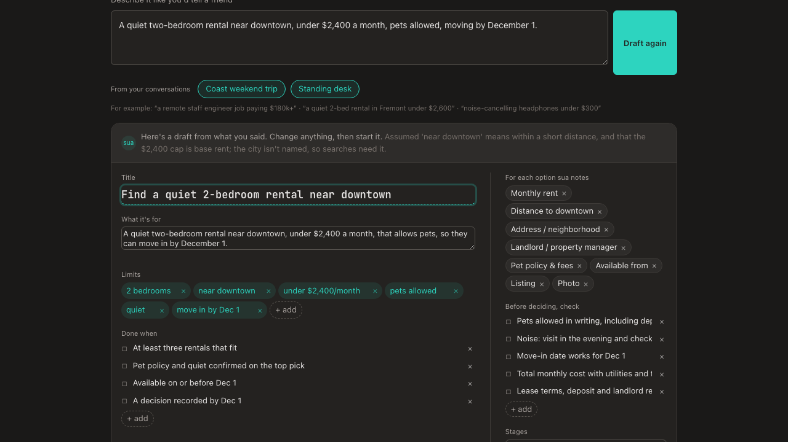
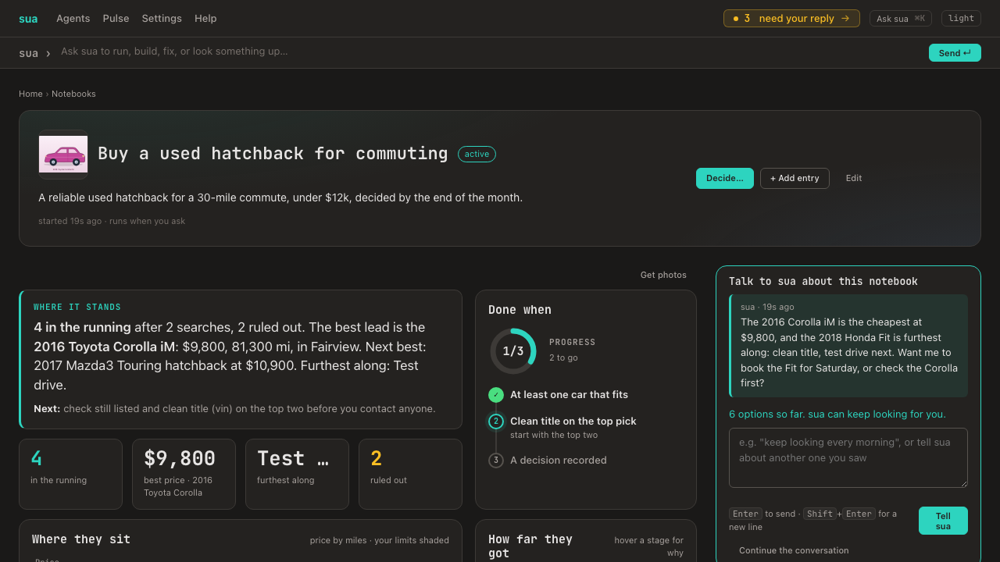
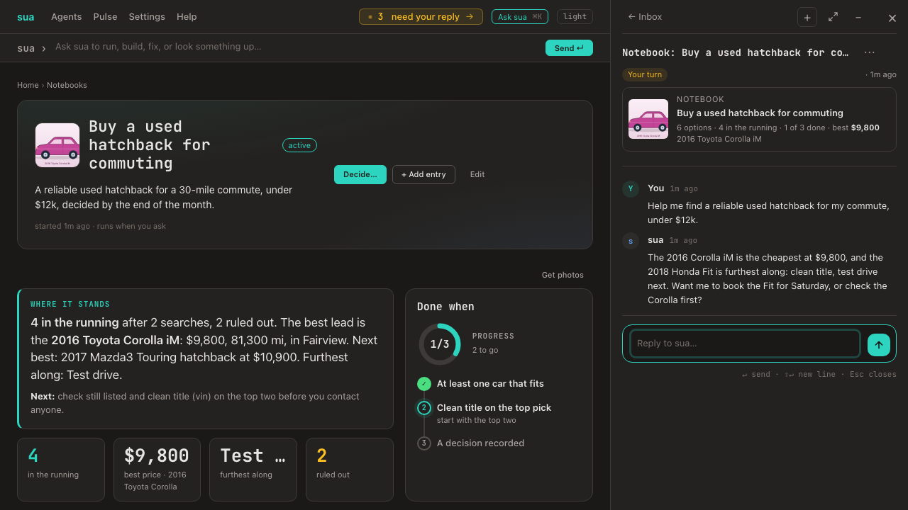

# Notebooks

A **notebook** is a goal you keep over time, like "Buy a used car" or "Find a new job". It holds:

- **what it's for**, in a sentence ("Find a reliable used SUV for family trips, and decide by Oct 15");
- **parameters**, the bounds it works within ("AWD", "under $26,000");
- **done when** criteria, ticked as they're met;
- a **pipeline**, the agents that gather for it, and how often they run;
- **entries**: options you're weighing, notes, evidence, and decisions, each with who added it;
- finally, **a decision** that closes it.

## Where to find them

There's no top-nav item yet. Notebooks show up:
- **on Home:** the **Your notebooks** shelf, a card per active notebook with its picture, best option and price, criteria as dots, and **sua asked you** when sua is waiting on you; plus **+ New notebook**. On Today each active notebook is one row: in **Needs you** while sua waits on your reply, otherwise in **Happening now** with its progress;
- **at `/notebooks`:** the list, with a ring showing criteria met, plus **New notebook**;
- **through sua:** ask "where's my used car goal?" or "what did I decide about the car?", and sua answers from your notebooks with a link.

- **The Notebooks page** lists them as cards (**+ New notebook** is at the top right). Each has a cover: the best kept picture among options still in the running (a listing photo first, then an example photo, then an illustration), or until there is one, a cover drawn for it in its own colour with an icon for what it's about (a car, a job, an instrument, a bike, a laptop, a home…) and its stages. Opening the page also starts finding pictures for options that have none. what it's for (or what you decided), the best price with its lead option, chips for options and how many are in the running, and how many done-whens are met. Tabs show **Active** (the default), **Decided**, **Stopped** or **All** with counts, plus **Archived** when you've archived any; search matches titles, goals, decisions and limits; sort by recently updated, newest or A–Z; 12 to a page.

## Archiving and deleting

Both are at the bottom of a notebook's **Edit** panel.

- **Archive** hides the notebook:
  - from your notebooks (**All** too), Home's shelf, Today, sua's notebook list and the agent catalog's "fills notebooks";
  - its schedule stops.

  Nothing in it is deleted, and its address and its options' pages still open, with an "Archived" note and **Restore**. Find it under the **Archived** tab. Restoring it brings it back as it was; its schedule waits for its next slot rather than catching up. Its conversation with sua still shows the notebook's card, and sua still files into it there.
- **Delete…** asks once, then removes the notebook and everything in it:
  - options, notes, evidence and decisions;
  - price history and searches;
  - passes, kept photos and its layout.

  Its page and its options' pages stop existing. Its conversation with sua and the runs that fed it stay. It can't be undone. While its pipeline is running, delete waits until the run finishes.

## Starting one



**+ New notebook** (on Home's shelf or the Notebooks page) opens **Start a notebook**:
1. **Say it in a sentence**, the way you'd tell a friend ("a reliable used hatchback for my commute, under $12k, within 50 miles, decide by the end of the month"), then **Draft it** (or press Enter).
2. **sua drafts the notebook:** a title, what it's for, your limits, what "done" means (with your deadline), what to note for each option, what to check before deciding, the stages an option moves through, and which of your agents could search for it, with how often.
3. **Check it.** Every part is editable: change or remove a limit, add a check, edit the stages, untick an agent. Or ask sua to change it ("only over-ear, drop the deadline").
4. **Looks right, start it** creates the notebook already set up, and sua says hello in its conversation with the next thing to tell it.

Under the box, up to three **pills from your conversations** suggest notebooks you might want: things you were looking for, researching or choosing with sua that aren't notebooks yet ("Tires for the RAV4"). Clicking one fills the box with the sentence; then **Draft it**. sua refreshes them in the background about twice a day (the `notebook-suggester` agent reads your own conversations, including finished and dismissed ones, but not a notebook's own conversation or sua fixing its agents).

Nothing is created until you start it. **Skip the draft** starts the notebook from your sentence alone, and sua asks the rest in its conversation.

## Talk to sua; it fills the notebook

**When you start a notebook, sua says hello first.** Once it has set the notebook up, it posts a message in the notebook's conversation:
- **First, the one most useful thing to tell it:** what the notebook is for, your limits, or any options you've already seen.
- **Then how it'll keep the notebook:** what it notes for each option, the stages, and what "done" means.

The conversation waits on your reply, so it's on Today. On the notebook page, the message shows under **Talk to sua**, and the big start box points there instead of offering a second place to type.

**The conversation shows its notebook.** In the inbox and in the sua drawer, a notebook's conversation has a card under its title: the notebook's picture, name, how many options are in the running, criteria done and the best price so far. Click it to open the notebook.

You don't fill in a notebook by hand. A new notebook opens with **Tell sua what you're looking for**. Talk it through: who it's for, budget, must-haves, what you've seen or ruled out. The conversation opens beside the page in the sua drawer.

- **sua files what you say as you go**, and the page updates on its own:
  - preferences and context become **notes**;
  - specific candidates become **options**;
  - facts about them become **evidence**;
  - "skip anything with a salvage title" becomes a **ruled-out decision**;
  - limits and "done when" lines are added to the notebook's parameters and criteria.

  This follows your autonomy setting: under Full it applies right away, otherwise it waits as a card. Every entry can be removed.
- **sua suggests a pipeline** when there isn't one, from agents you have (e.g. a listings search every morning). That's a **Set up the pipeline** card you approve, and it can run once right away.
- **Agents sua runs in the conversation feed the notebook.** A search becomes options, evidence, or a note such as "Searched Seattle Craigslist for Foresters: nothing that fits yet", each linked to its run. When sua builds an agent for the notebook, it offers to add it to the pipeline.
- **New limits replace the ones they contradict** ("budget is now $3–6k" drops the old range).
- **Corrections change the option itself.** Say "the price is actually $136.64" or "it's 30 inches, not 24", and sua updates that option's facts, so its card, its page, the chart and the stats change too. It isn't filed as a separate note. The option's history shows **Corrected**, with what it replaced ("Price $4,023 → $136.64"). The old source and estimate mark for that fact go. A correction stands over the option's own title and earlier searches. A corrected price starts the price history over, so fixing a wrong price doesn't read as a price drop.
- **The notebook keeps its conversation.** the page shows sua's latest message, **Continue the conversation** reopens it, and a conversation started from the notebook's page belongs to it. To add an entry yourself, use **+ Add entry** in the notebook's header.

- **With the sua panel open,** the page's **Talk to sua** box is hidden, so there's one place to type, and the notebook widens into the space it leaves. Closing the panel on the notebook's conversation refreshes the talk box and the notebook, so sua's latest reply shows.
- **Enter sends** what you type in **Tell sua** (as in the drawer); **Shift+Enter** starts a new line, and **Cmd/Ctrl+Enter** sends too.

## A notebook's page





**The header shows the notebook's picture** (a listing photo, an example photo or an illustration of the lead option), the same one its card and conversation show. A notebook with no picture yet shows the notebook icon.

**The sua panel follows you to a notebook.** Open a notebook with the panel open (docked or wide) and the panel switches to that notebook's conversation. A closed or minimised panel stays as it was.

- **The cover** shows the title, status, what it's for, the parameters, and the cadence. The pipeline is drawn as connected agents, each with its last run (ran, failed, not run yet, not installed). A ring shows how many criteria are met; click a criterion to tick it.
- **Its sections** are drawn from the notebook's own surface (`notebook:<id>`; see [surfaces](surfaces.md)):
  - **Options**;
  - **Notes and decisions**, with decisions first;
  - **Evidence**.
- **+ Add entry** (in the header, beside **Decide…**) adds a note, an option, evidence, or a decision.
- **Edit** (also in the header) changes the title, what it's for, parameters, criteria, pipeline (agent ids) and schedule.
- **The schedule runs the pipeline.** A notebook with a schedule ("every morning") runs its searches when it's due, the same as pressing Run. The header says when it runs next. Each due time runs once. After the dashboard has been off, it catches up with one run, not one per missed time. A new or changed schedule waits for its next time. A schedule needs at least one search to run; without one the header says so. Scheduled runs are marked **on schedule** in **How it was made**. Schedules run while the dashboard is running (always, under `sua daemon`). See [ADR-0050](adr/0050-notebook-schedules-run-in-the-dashboard.md). Editing the criteria keeps the ticks on the ones you didn't change.
- **Decide…** records what you decided and why. The decision is also kept as an entry, and the notebook closes. **Reopen** any time; **Stop** pauses a notebook without deciding.

## Option facts

Options record their facts as data, not only as text, so they can be compared, sorted and charted.

**Numbers are checked against what the search said.** When the keeper files what a search found, every number it gives (a price, miles, a width, a count) must appear in that run's output. It's matched the ways people write it: "$4,023", "4.9k", "157k mi", "1.2M", "18 million", "125–175k", "two hooks", within 1% for rounding. A number the output never states is left out rather than guessed. The run's note on the notebook says so ("1 number not in its output left out"), and a later search that states it fills it in. Facts setup gives an option must appear in that option's own text, or in the output. An agent that files its own `<notebook>` block from code isn't second-guessed.

- **Each notebook has fields:** what every option records, e.g. price, miles, year, location and listing for a car; rent, sq ft and neighborhood for a flat.
- **sua sets them up for you,** along with the stages: in the background when you start a notebook (from its goal), when a notebook has options but no fields (the first time you open it, or right after sua files an option from your conversation), or the first time a search finds options. Setup gives options already in the notebook their facts, read from their text. While it runs, the page says "sua is setting up what to track…" and redraws when it's done; it's tried once per notebook. Each field has a type (money, number, text, link, image, date) and, optionally, a role. The roles are what let one widget work for any notebook:
  - `price`: what it costs;
  - `measure`: the main number to compare;
  - `place`;
  - `link`: the listing;
  - `image`;
  - `when`;
  - `org`: the company or seller, to group by.
- **Money and number fields say which way is better.** A price is better lower, a salary or a rating higher. Ranking and charts use it, and a `price` field is better lower unless the notebook says otherwise.
- **Ranges:** a money or number field can take a span ("$150k–$180k", shown as $150,000–$180,000). Sorting and charts use its midpoint.
- **Any kind of search fits.** For a car: price, miles, year, location, listing. For a job: salary (a range, better higher), company (`org`), commute, posted date, posting. For a product: price, rating (better higher), store (`org`), photo.
- **Options kept before the notebook had fields** get filled in from their text when the fields are set. Only unambiguous facts are read: a dollar amount, a number with the measure's unit, a leading year, a web address.
- **The same option is one entry.** Each option has a fingerprint: a VIN or listing id when the agent gives one, else its listing's address. When a later run finds it again, its facts are refreshed and the card says "seen again". It isn't added a second time.
- **On the page**, an option shows its facts as chips (the price highlighted) and its listing as a link.
- **Price history:** each time a search finds an option, what it said is kept. A card shows how the price moved since it was first seen ("↓ $123 since Oct 5"): green when it moved the way that's better (lower for a price, higher for a salary), amber otherwise.
- **Photos:** a notebook keeps a copy of each option's photo, so a card shows the actual car (or flat, or product), even after the listing is gone. After each search, when you open the notebook, and when you press **Get photos** on the Options heading, sua tries options that don't have a listing photo yet (an example photo or an illustration doesn't count; a real photo replaces it):
  - the option's image field (role `image`), when the search gave a photo address;
  - otherwise its listing page's own preview photo. The listing is the option's link field, or when the notebook has none, the first of its facts holding a web address (an "Availability" field with a product page counts; it also gives the option its **Listing ↗** button). The photo is used only when the address is one listing (it carries an id, not a page of results) and the page's title names the option (its year and model). A results page shows a generic picture, which would be the wrong car.

  Every photo is fetched with the same guards as web pages (no private or local addresses, every redirect checked) and must be a real JPEG, PNG, GIF or WebP of at most 3 MB; never SVG. The copy is kept in sua's database and served from your dashboard, so the page never loads from the seller's site. An address that didn't give a photo isn't tried again, and an option keeps its example photo or illustration when it doesn't. Images are requested as WebP, PNG, JPEG or GIF, so image servers that would otherwise send AVIF (which isn't kept) send one of those. Some sites block automated requests (AutoTrader serves a "page unavailable" page), and results-page links give no photo, so the most reliable source is a search agent that returns each listing's own link and photo address.
- **Representative pictures:** an option still without a photo (the listing gave none, or blocked the request) gets a **representative** one: sua's `notebook-picture` agent searches for a picture of what it is (a Wikimedia photo of that model and generation, the product's image, the company's logo), fetched with the same guards as listing photos (one at a time, retrying a busy host; large Wikimedia originals as 500px thumbnails). When none can be found or fetched, sua shows its own **illustration** of what the option is (a car, a bike, a guitar, a laptop, a home, a company's monogram for a job), tinted per option and labelled with its name, and tries for a real photo again a day later. Cards label them **example photo** or **illustration**, so they're never mistaken for the real one. This runs after each search, from **Get photos**, and when you open a notebook or the Notebooks page; ruled-out options are skipped.
- **Pictures show whole.** Everywhere a picture appears (shortlist cards and table, the option's page, the notebook's header, the Notebooks page, Home's shelf, the conversation's card), it's scaled to fit its frame, never cropped. A tall photo (a guitar) sits in the middle of a wide frame, and every card in a row keeps the same frame size however tall its photo is. A frame holding a photo is the card's own surface, so a product shot on white blends in; illustrations keep their tinted frame. The same goes for pictures in messages, run output and Pulse tiles: they scale down to fit their column.
- **Not seen lately:** each search is recorded, along with how many options it found. When the last 2 searches by the agent that found an option found other options but not this one, its card says "not in the last 2 searches". It may be sold, filled or taken down. A search that found nothing doesn't count, since web search results vary from run to run. Being found again clears it.
- **For widgets:** `GET /notebooks/<id>/data.json` returns the notebook as data, the same shape for every notebook:
  - `limits`, `criteria`, `progress` and `fields`;
  - `options`, each with its facts by key, `priceHistory` and `priceChange`, `missedSearches` and `notSeenLately`, plus `price`, `measure`, `place`, `org` and `link` picked out by role, `image` (the kept photo's address on your dashboard) and `imageSource` (where it came from) (a range's midpoint for `price` and `measure`), and `firstSeenAt` / `lastSeenAt`;
  - `notes`, `evidence`, `decisions` and `history`.

## Widgets

Once a notebook has fields and options, its page is drawn as A2UI widgets (see [A2UI views](a2ui-views.md)), the same for a car, a job or a product:

- **Where it stands:** a short paragraph (how many are in the running, the best lead and the next best, the furthest stage) with **Next:**, e.g. "check still listed and clean title on the top two before you contact anyone". Beside it, **Done when** shows a progress ring and the steps, with the current one highlighted.
- **Stats:** in the running, best price (or pay), furthest along, ruled out.
- **Where they sit:** price against the main measure (miles, sq ft, commute). Your limits are shaded, the best lead in the running is highlighted, and ruled-out options are hollow. Hover or tap a dot for its name, price and measure in full, and where it stands. Click a dot to open [its page](#an-options-page); on a phone, tap it, then **Open →**. **How far they got** shows the funnel per stage, with ruled-out counts (hover for why).
- **Shortlist:** cards (photo or "No photo yet", rank, a short name, price, facts, stage, price move) or a table. A card's or row's name opens the option's page. **Filters** above the cards narrow the list. Each shows as a row of chips, and each chip says how many options picking it would show:
  - **Listing:** current, or not seen lately;
  - **Stage**;
  - each text fact the options differ on (seller, make/model, location…).

  Filters combine. Ranks and the best stay those of the whole shortlist. **Clear filters** resets them, and your choice is remembered in this browser for that notebook. Ruled-out options are **hidden by default**; **Show ruled out (N)** brings them back, and your choice is remembered in this browser. Each card has **Listing ↗**, **<next stage> →** and **Rule out…**, whose first choice is **No longer available** (sold, filled, out of stock), followed by quick reasons or your own words. "Not seen lately" cards also offer **Mark gone**.
- **Before you decide** (a third of the row): a checklist for the top two (the notebook's checks, e.g. Still listed, Clean title). Tick boxes right there.
- **How we got here** (two thirds of its row): a timeline, newest first. **Each search** shows which agent ran, when, its run (linked), and how many options it returned, plus which sites it reached when known; searches from before that was recorded are rebuilt from the options each run added, and **failed runs** of the agents that feed the notebook show too (they leave nothing else behind). Notes, decisions and rulings, and moves are there as well. Filter chips (**All**, **Searches**, **Notes**, **Decisions and rulings**, **Moves**, each with a count) narrow it; **Show all** goes past the first 8.
- **Where sua looked:** the latest search's sites: how many it found on each, and which were blocked or skipped. **Limits:** your limits, with ones that disagree (two different budgets, two mileage ranges) flagged.

A notebook without fields shows cards instead. The widgets bind to the notebook's data (`/notebook/...`, the same as `data.json`), so they can be rearranged or placed on a board later.

**No longer available** is not a ruling: the option leaves the running and reads "No longer available", not your reason. Tell sua too ("the RAV4 sold", "they filled the Stripe role").

**Facts are checked against the option's own text.** If a fact sua records for an option contradicts the year, price or measure its text states (a model can mix up two options), the text wins. That text describes the option when it was filed, though: when a later search finds the same option again (by its link) and sees a newer price or measure, the newer facts win over the text. Facts stored before this check are repaired when you open the notebook. Only numbers count: a link in the text (a source, the post a quote came from) never counts as a mix-up and never replaces the option's own link; it fills in only when the option has none. Fields without a role get the one their name implies (`price`, `miles` in mi, `listing_url`, `photo`, `location`, `seller`).

**Deciding** (**Decide…** in the header) speaks about this notebook. Its example names your leading options (furthest stage first, then the best price), and **Start from** chips for up to three options still in the running begin the answer with "Chose ___: ". Recording the decision closes the notebook.

## An option's page

Each option has its own page at `/notebooks/<notebook>/entries/<option>`, with everything the notebook keeps about it. Open it from a dot on **Where they sit** or an option's name on the **Shortlist**.

- **Previous / Next** (top right, beside the breadcrumbs): the options either side of this one in the running, best first: **← #2 …**, **3 of 22**, **#4 … →**. The **←** and **→** keys do the same (not while you're typing).
  - They follow the filters you picked on the notebook's **Shortlist**: with **Listing: Current** on, Next skips listings not seen lately, and the count reads **2 of 5 filtered**.
  - A ruled-out option has no Previous / Next.
- **The header:**
  - its picture;
  - its short name and full title;
  - where it stands: **best price** (or best fit), or **#3 of 12** in the running;
  - its price, with the latest move;
  - the controls the cards have (**<next stage> →**, **Rule out…**, **Bring back**), which return to this page;
  - **Listing ↗** and **← Back to the notebook**;
  - who found it, when, and when it was last seen.
- **What sua knows:** every fact, in the notebook's field order. The cards show at most five. A fact whose value is a web address (a link field, or any field holding one, like "Availability") is a link; on a card it shows the site (**target.com ↗**). An estimate reads **≈**, a fact with a source links to it, and the quote that backs a fact is shown under it (marked "checked in the source" when code found it there).
- **Price over time:** each price a search saw. It's shown once the price has changed.
- **Before you decide:** the notebook's checks for this option, whatever its rank; the notebook page shows them only for the top two. Ticking one saves it.
- **Its history**, newest first:
  - **Found** (or **You added it**);
  - each search that found it again, with **Price dropped / went up** and the old and new price;
  - its move to a stage;
  - its ruling and why.

  Each entry links the run behind it.

- **Talk to sua about this item** (beside the details): ask about this option, or correct it ("is it still available?", "the price is actually $136.64").
  - It goes into the notebook's conversation and opens it in the sua drawer.
  - The message names the option ("About “Zeus & Ruta…”: …"), and sua gets everything the notebook knows about it, so it answers about that one. A correction changes the option itself.
  - With the drawer open, the box hides and the details widen, as on the notebook's page.
  - Asking from the notebook's own box afterwards drops the focus on that option.
  - **"Next"** ("open the next item", "I'm done with this one, go to the previous") goes straight to that option's page, the same one the Next button names, without asking sua. Anything more ("rule it out and open the next") goes to sua: it does what you asked about this one, then links the next one (sua knows the options either side of it, in rank order).

A note, evidence or a decision has no page of its own; its address goes to its place in the notebook.

## Ranked by fit, not price

Some notebooks aren't about the cheapest option: accounts to qualify, leads, vendors. A field with the role **score** (how well an option fits, e.g. an ICP fit from 0 to 100, higher is better) changes how the notebook ranks:
- **Where it stands** names the **best fit** ("fit 88, 140 employees, in Austin") and the next best by fit.
- The stat shows the best fit, the shortlist is "ranked by fit, highest first", and each card shows its fit as the headline number with a **Best fit** ribbon.
- **Decide…**, Home's shelf and the Notebooks page pick leads by fit too.

sua's drafter adds a fit score to account-style notebooks ("companies with $10–50M revenue and 50–500 employees…"), keeps revenue a plain fact (not a price), and the keeper scores each option it files against your limits and criteria. A field named `fit`, `icp_score` or `match_score` gets the role on its own. Without a score field, notebooks rank by price as before.

**Where a fact came from.** A fact can carry its source and whether it's an estimate (revenue and headcount usually are). The keeper adds them when a run's output says where a figure came from or that it's approximate. On the shortlist, an estimate reads **≈ $30M–$40M** (dashed), and a fact with a source links to it (**$20M ↗**). When a later search states the fact again, its source and estimate flag are replaced (or cleared, if it's simply stated); facts it doesn't mention keep theirs. Agents can give a fact as `{"value": 20000000, "source": "https://…", "estimate": true}` instead of a bare value.

Money of a million and up reads short ("$18M–$22M"). Companies get a monogram tile from their company name when there's no picture.

## Stages and ruling out: the funnel

Options move through the notebook's **stages** toward a decision, and you can rule any of them out.

- **Each notebook has stages,** e.g. Found → Checked → Test drive → Offer → Bought for a car, or Found → Applied → Screen → Interview → Offer for a job. The keeper proposes them along with the fields; you can change them with **Edit** in the header (one per line). New options start at the first stage. If you remove a stage, its options move to the first one.
- **Move an option along** with **Move to <next stage> →** on its card, or tell sua ("I applied to Stripe and Plaid", "we test-drove the RAV4").
- **Rule an option out** with **Rule out…**: pick a quick reason (Not interested, Too expensive, No reply, Failed a check) or write your own. Or tell sua ("rule out the XT, too pricey", "no callback from Plaid").
  - A ruled-out option **stays in the notebook,** dimmed and at the end of its section, showing where it was ruled out and why: "Ruled out at Applied: no callback". **Bring back** undoes it, and so does moving it to a stage.
  - **Ruled out stays ruled out.** When a search finds the same option again (same fingerprint), it isn't suggested again. The keeper also sees why options were ruled out and skips others that fail for the same reason. When three or more are ruled out for one reason, sua offers to make it a limit.
- **The funnel** above the options shows how many reached each stage and how many were ruled out there ("4 Found −2 → 1 Checked → 1 Test drive"); hover for the reasons.
- **In conversation, sua can also tick a done-when criterion** when what you said shows it's met ("the title's clean").
- `data.json` includes `stages`, a `funnel` (per stage: reached, here now, ruled out, top reasons), each option's `stage`, `stageIndex` and `ruledOut`, and `active` / `ruledOutCount`.

## How it was made

**How it was made →** (in the notebook's header) opens its **Workflow**: every run that filed into the notebook, the runs those started (a sweep's calls to other agents, loops, agents used as tools), and what each left ("3 options · 2 notes · saw 3 again"), drawn as one graph, left to right, the same way a run's steps are drawn. Click any box to open that run.

Runs come in **passes**: one go at filling the notebook. A pipeline run of all its agents is one pass (failed runs included); a run filed from the notebook's conversation, or with **Add to notebook**, is a pass of its own. Pick a pass at the top to draw it (the newest is drawn first); the list under the graph groups every run by pass, with each pass's note ("3 new entries · car-sweep: 3 new"). Runs from before passes were kept show as **Earlier run**, one each.

A run's own page links back too: **Notebook: *title* · how it was made**, including for a run that another agent started ("through the run that started this one"). A run another agent started counts as part of its parent's search, so it's never offered under **Runs not in this notebook yet** and never shows as a failed search of its own.

## Account research

The **account-research** agent fills an accounts notebook ("B2B software companies with 50–500 people that run Kafka and are hiring platform engineers") from what companies say in their own public job posts. It needs no API keys.

1. **Plan:** it breaks the profile into signals (the stack they run, the problem they have, the roles they're hiring) and searches the Ashby, Greenhouse and Lever job boards for them, skipping job aggregators and staffing firms.
2. **Read:** code fetches each company's posts from the boards' public APIs and keeps the ones that mention the signals.
3. **Score:** each company gets a fit score from 0 to 100 on a fixed rubric, backed by a word-for-word quote from its post:

   | Score | Tier | What the post shows |
   |---|---|---|
   | 85–100 | Tier 1, immediate fit | an active initiative or problem the profile is about |
   | 70–84 | Tier 2, high potential | the stack and senior hiring for it; the problem is implied |
   | 50–69 | Tier 3 | size or industry only |
   | below 50 | Unfit | filed as ruled out, with why, so the next search doesn't bring it back |

4. **Check:** code, not a model, checks every quote is in the post word for word. A score whose quote isn't can't rank above tier 3, and its card says so.

The notebook files the result directly: company, fit, tier, and the job post as the option's link. Under each fit score the card shows the quote, marked **✓ checked in the source** and linked to the post. Revenue and headcount are filled only when a post states them, and marked as estimates. Ideas from [account-fleet](https://github.com/NatesVibeCode/account-fleet).

## Which agents fill notebooks

An agent "fills" a notebook when it's in the notebook's searches or has filed into it. The agents list badges them (**feeds 2 notebooks**) and the **Feeds notebooks** chip narrows the list to them. An agent's page shows the notebooks it fills under **Connections**, next to the agents it runs and the ones that run it. When sua drafts a new notebook, agents that already fill notebooks are listed first and preferred for its searches.

## Download the shortlist

**Download CSV** in a notebook's header saves its shortlist as a spreadsheet, best first (by fit when the notebook has a fit score, else by price). It has one column per fact (numbers as plain numbers, ranges as `min-max`), then which facts are estimates, where facts came from, the quote that backs the ranking and whether it was checked, how many of the notebook's checks are done, and when each option was first and last seen. Add `?all=1` to the address to include ruled-out options, with why. It opens cleanly in Excel, Numbers and Google Sheets. Text that a spreadsheet would run as a formula is prefixed with `'`.

## Filing directly (for agent authors)

Normally sua's keeper reads a run's output and decides what to file. An agent that already knows the notebook's shape can skip that: put a `<notebook>` JSON block in its output, and the notebook files it as is: no keeper model, no 12,000-character limit, up to 50 entries per run. It's cleaned exactly like the keeper's own output (fields, links, facts, sources).

```
<notebook>
{"entries": [
  {"kind": "option", "title": "Ledgerline, AP automation", "body": "Why it fits…",
   "fingerprint": "ledgerline.example.com",
   "data": {"company": "Ledgerline", "website": "https://ledgerline.example.com",
            "revenue": {"value": 20000000, "source": "https://…"},
            "employees": {"value": 140, "estimate": true}, "fit": 88}},
  {"kind": "note", "title": "Searched the startup directory: 3 more were outside the revenue range"}
],
 "sources": [{"name": "Company directory", "found": 12, "status": "found"}],
 "criteriaMet": [0],
 "summary": "One line on what this run found."}
</notebook>
```

`data` keys are the notebook's field keys. A fact can also carry `"quote"`: the words in its source that back it (15+ characters); add `"checked": true` only when your agent's code found them there. The mark is believed only from a directly filed block, never from sua's keeper. An option can carry `"ruleOut": "why"` to file it ruled out. Entry kinds are option, note, evidence and decision. A block with no entries (or that isn't valid JSON) goes to the keeper as usual. The pass note says "(filed directly)".

## Runs not in the notebook yet

A run's results go into the notebook by themselves when it was started from the notebook's conversation or its pipeline. A run of one of its agents started anywhere else (the agent's **Run** button, its schedule) isn't filed. The notebook page lists these under **Runs not in this notebook yet**: finished runs from the last two weeks, by agents that have filled this notebook. **Add to notebook** files one the same way: new options, evidence and notes, a search on the timeline, and pictures. Options already there are refreshed, not repeated.

## The pipeline

With **Edit** in the header, list the agents that gather for the notebook, one id per line, in order. **Run the pipeline now** runs them one after another. The diagram shows which agent is running, and the page updates as it goes.

- **Each agent gets the notebook's goal.** Any input it declares named `GOAL`, `NOTEBOOK`, `NOTEBOOK_CONTEXT` or `BRIEF` gets the statement, parameters and criteria. `TOPIC`, `QUERY`, `QUESTION` or `SEARCH` gets the statement. Other inputs keep their defaults.
- **The notebook keeper turns output into entries.** After each agent finishes, the keeper (a built-in sua agent, `notebook-keeper`) reads what it found against the notebook's goal, parameters, criteria and existing entries. It writes what's new:
  - **options** that fit the parameters;
  - **evidence** about them;
  - **notes**;
  - **ruled-out decisions** with the reason, e.g. "Ruled out: 2018 CR-V, over the mileage limit".
- **Nothing is added twice.** It skips anything whose title the notebook already has, and adds at most 12 entries per agent per run. An option it finds again (see [Option facts](#option-facts)) is updated instead.
- **Each entry links back** to the agent and run it came from.
- **Criteria:** if an agent's output clearly shows a criterion is met, the keeper ticks it and adds a "Met: …" note saying why. It doesn't tick on a guess.
- **The last run's summary** shows under the diagram, e.g. "8 new entries · listings: 8 new". A failed agent or a missing one is noted there too, and the rest of the pipeline still runs. A notebook runs one pipeline at a time.

## Coming next

- **G4:** one schedule for the notebook (runs now; see above). Still to come: each run shows what's new or changed, and progress against the criteria.
- **G5:** "start a notebook to research X" from sua drafts the notebook, its pipeline and schedule behind one approval.
